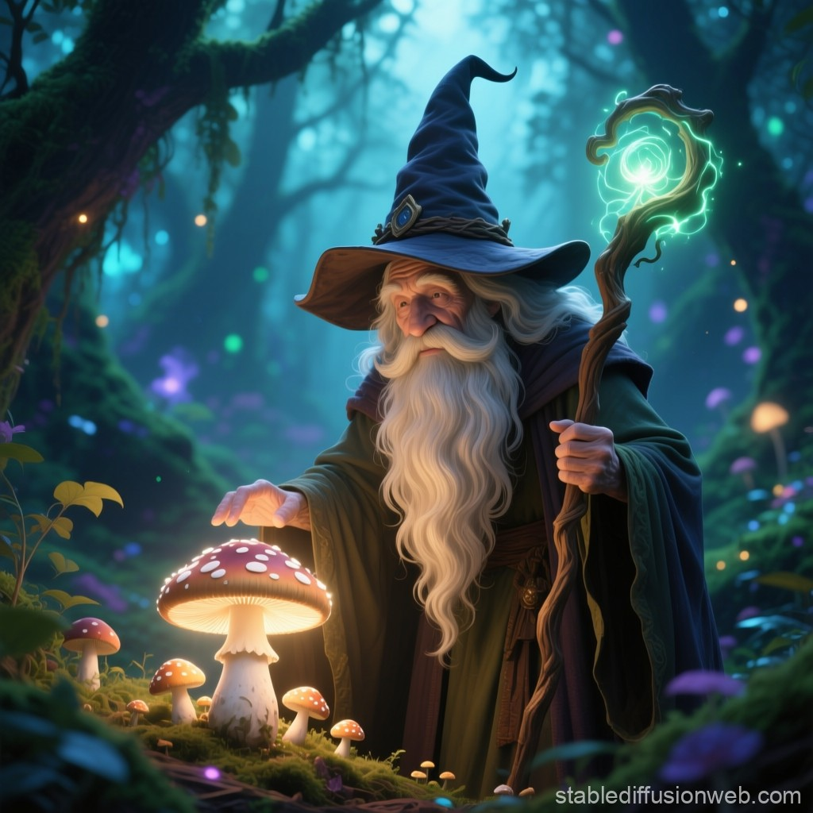

  <h1 align="center">The Wizard's Discovery</h1>

<a href="./output/The Wizard's Discovery.mp3" download>
    <button style="background-color: #28DA77; color: white; padding: 12px 24px; border: none; border-radius: 5px; font-size: 16px; cursor: pointer;">
        🎧 Escutar Podcast (Baixar)
    </button>
</a>

<small>Clique no botão acima para baixar e escutar o podcast</small>

  
<strong>✨ Sobre este podcast:</strong>

  
Uma encantadora história sobre o bruxo Ventania e sua descoberta mágica na Floresta Proibida. 
  Perfeito para crianças e adultos aprendendo inglês, esta narrativa ensina valiosas lições sobre 
  generosidade e o verdadeiro significado da magia. O que acontece quando um presente precioso 
  é compartilhado? E qual será o destino final do misterioso cogumelo luminoso?

  
  
<em>"The greatest spell is not what we keep, but what we share..."</em>

# Projeto Podcast Gerado por I.A.s

Bootcamp Sandanter Universia – Fundamentos de IA Generativa. Aula prática com objetivo de gerar um Podcast utilizando ferramentas de IA através de prompts personalizados.

## 💻 Tecnologias utilizadas no projeto

- [ChatGPT](https://chat.openai.com/) 
- [MidJourney](https://www.midjourney.com/app/)
- [ElevenLabs](https://beta.elevenlabs.io/)
- [Capcut](https://www.capcut.com/pt-br/)

## ✨ Como foi feito ?

- Roteiro gerado via chatgpt
- Audio gerado pela elevenLabs
- Midjourney Para gerar capas
- Capcut para tratar aúdio e adicionar sons de fundo
